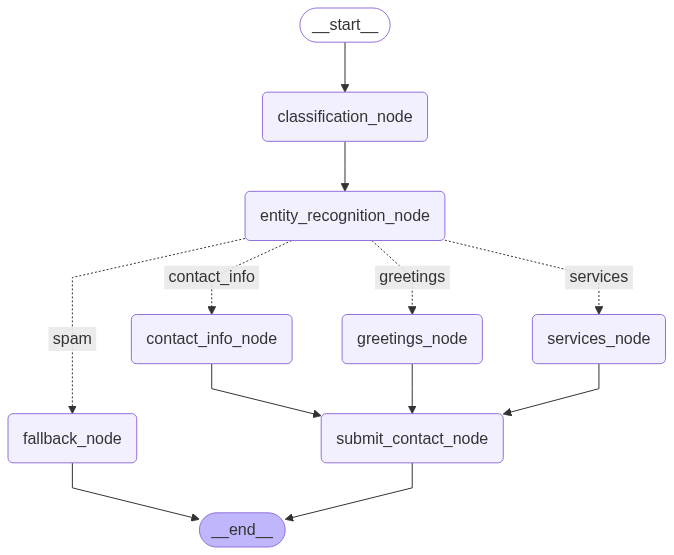

# 🧠 LLaMA 3 Chatbot with FastAPI, LangGraph, and Qdrant

This project is a chatbot application powered by **LLaMA 3**, built using **FastAPI** and **LangGraph**, and integrated with:

- 🧠 **LLaMA 3** via `vLLM` for natural language understanding
- 🌐 **FastAPI** for exposing webhook routes
- 🔍 **Qdrant** vector database for semantic memory or document retrieval
- 🤖 Integrated with **GoHighLevel (GHL)** and **WhatsApp**

The chatbot gathers user information (name, profession, email), sends it to **GHL** and stores it in a **Google Spreadsheet**.

---

## 🐳 Docker Compose Services

The project uses **Docker Compose** to orchestrate the following services:

- `fastapi`: The main backend app handling webhooks and LangGraph processing.
- `vllm`: Hosts the LLaMA 3 model for fast inference.
- `qdrant`: Used for vector-based retrieval if needed in the chatbot flow.

---

## 🚀 Getting Started

### 1. Clone the repository

```bash
git clone https://github.com/GabrielGlzSa/DCMChatbotTest.git
cd DCMChatbotTest
```

### 2. Create an .env file

For security, all API keys are stored in an .env file in the project's directory. You must fill the following information.

- `WHATSAPP_TOKEN` = Token obtained from [Meta's developer platform](https://developers.facebook.com/apps/)
- `WHATSAPP_VERIFY_TOKEN` = You create this token and place the same value in your [Meta's developer platform](https://developers.facebook.com/apps/)
- `GHL_API_KEY` = Obtained in the settings of your GoHighLevel account.
- `GHL_LOCATION_ID` = Same as above.

### 3. Build and start the services
The project uses docker containers. To run the containers use the following command:

```bash
docker compose up --build
```
This will start:

vllm serving the LLaMA 3 model

fastapi backend on http://localhost:8000

qdrant accessible on http://localhost:6333

Meta requires that the webhook server has a certificate for HTTPS. This can be avoided by creating a secure tunnel using to the following command, which generates a URL that should be used for attending requests: 

```bash
ngrok 8080
```

### 4. Additional info
Only two routes were implemented. Nonetheless, more can implemented to handle incoming messages from Facebook, Instagram, etc.

📬 Webhook Endpoints

POST /test_crm → Receives messages from GHL chat widget

POST /whatsapp → Receives WhatsApp messages


### 5. Design choices

The chatbot uses LangGraph to narrow the possible ways the customer can interact with the model. Once a message is received, it is classified to determine the intent of the customer. After classification, the message is analyzed to find personal information that the user could have provided. This is done for all messages since the user could mix multiple types of messages (contact_info + asking for services). The following section has a summary of each node in the graph.





## 🧠 LangGraph Node Summary

- **`__start__`**
  - Entry point of the graph.
  - Leads to the `classification_node`.

- **`classification_node`**
  - Determines the type of incoming message.
  - Routes to the appropriate branch (e.g., contact info, greetings, services, or spam).
  - Classification is done using few shot prompting. The examples are located in `data/documents/few_shot_examples/classification.csv`

- **`entity_recognition_node`**
  - Extracts entities such as name, email, phone number and profession.
  - Routes to specific intent nodes.
  - Entity recognition is done using few shot prompting. The examples are located in `data/documents/few_shot_examples/entity_recognition.jsonl`

- **Branches:**
  - **Contact Info (`contact_info`)**
    - ➜ `contact_info_node`: Verifies user contact details and requests any missing information.
  
  - **Greetings (`greetings`)**
    - ➜ `greetings_node`: Responds to greetings like "hi", "hello", etc. and asks for contact information as the profession is a requirement to access to the services branch.
  
  - **Services (`services`)**
    - ➜ `services_node`: Handles inquiries about services offered. Only accessible if profession has been provided. This node uses Retrieval Augmented Generation (RAG) to answer questions using the text files located in `data/documents/`. These files are used to fill the Qdrant database, which stores data as vectors, for semantic retrieval.
  
  - **Spam (`spam`)**
    - ➜ `fallback_node`: Ends the conversation by saying that it is only able to answer questions about the services provided by the company.

- **`submit_contact_node`**
  - Common endpoint for valid conversations.
  - Submits collected contact info to external systems (e.g., GHL, [Google Sheets](https://docs.google.com/spreadsheets/d/1ghZOXBjthIWKW5G4zUllSjr_l4iEDlgIge2bEtgl7Zk/edit?usp=sharing) once all required information has been gathered.

- **`fallback_node`**
  - Handles unrecognized or invalid input.
  - Routes to end if necessary.

- **`__end__`**
  - Exit point of the graph.
